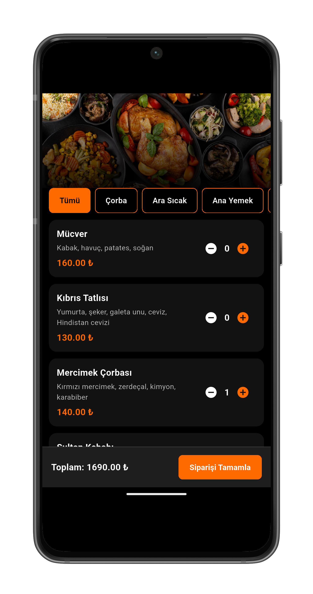
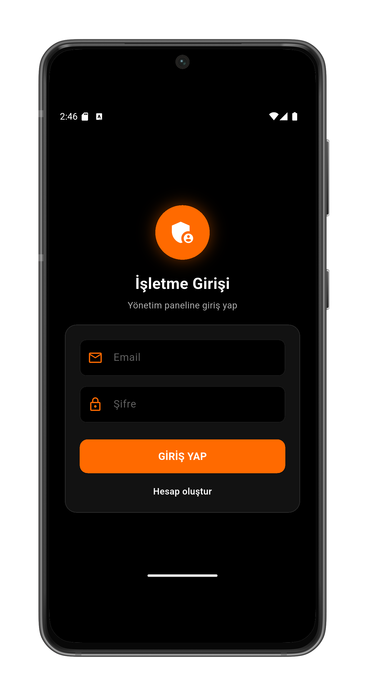
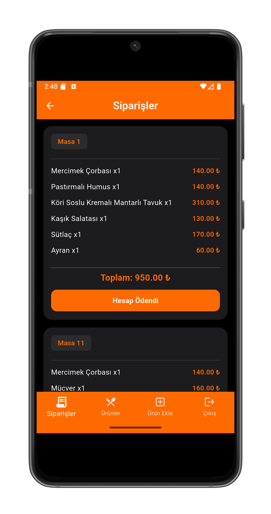

# 🍽️ Restaurant Order & Management System

This project is a Flutter + Firebase based mobile application developed for restaurants to manage
orders and products efficiently.

The system is designed for restaurant staff usage:

- Waiters create orders
- Kitchen and business staff view orders in real time

---

## 🚀 Features

### Waiter Side

- Category-based product listing
- Add / remove products to cart
- Automatic cart total price calculation
- Create orders by selecting table number

---

### Business Side

- Real-time order viewing
- View orders by table number
- Delete / close orders (payment completed)
- Product listing
- Add new products
- Update products
- Delete products

---

## 🧱 Technologies Used

- Flutter
- Dart
- Firebase Firestore
- flutter_bloc (Cubit)
- Material Design

---

## 🗂️ Application Architecture

- Bloc / Cubit state management
- Clean and modular structure
- Real-time Firebase synchronization
- Separation of UI, logic and data layers

---

## 🔄 Application Flow

1. Waiter selects products and creates an order
2. Order is saved to Firebase Firestore
3. Business panel displays orders in real time
4. Products can be managed (add / update / delete)
5. Order is closed when payment is completed

---

## 📱 Screenshots

<p>
  
  
  
</p>
<p>
  
  
  
</p>


---

## 🔧 Installation

```bash
git clone https://github.com/sametbayyurt/food_order.git
cd food_order
flutter pub get
flutter run
